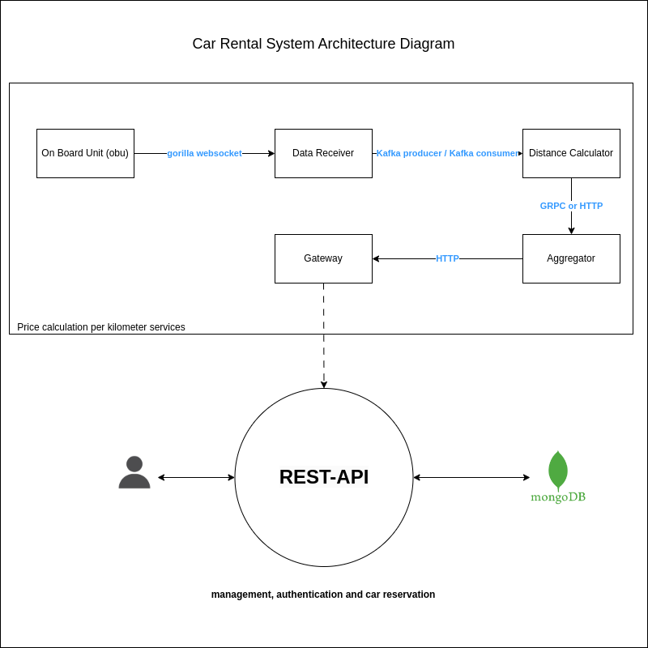

# Car Rental System

The Car Rental System is a distributed system that simulates a car rental service, consisting of multiple microservices for handling OBU (On-Board Unit) data, distance calculation, aggregation, gateway communication, and a REST API for user management and reservations.

## Overview

The system is divided into the following microservices:

- [Data Receiver Microservice](data-receiver/README.md)
- [Distance Calculator Microservice](distance-calculator/README.md)
- [Aggregator Microservice](aggregator/README.md)
- [Gateway Microservice](gateway/README.md)
- [REST API Microservice](rest-api/README.md)


  


## Getting Started

### Prerequisites

Ensure you have the following prerequisites installed for the entire system:

- Go programming language
- Kafka broker running and accessible
- Prometheus for monitoring (optional but recommended)
- MongoDB database configured and accessible

## Configuration

The system uses environment variables for configuration. Modify the .env files in each microservice's directory with the necessary details.

## Microservices

### Data Receiver Microservice

[Data Receiver Microservice README](data-receiver/README.md)

### Distance Calculator Microservice

[Distance Calculator Microservice README](distance-calculator/README.md)

### Aggregator Microservice

[Aggregator Microservice README](aggregator/README.md)

### Gateway Microservice

[Gateway Microservice README](gateway/README.md)

### REST API Microservice

[REST API Microservice README](rest-api/README.md)

## Running the System

To run the entire Car Rental System, follow these steps:

### Start Data Receiver Microservice:

```
make receiver
make obu
```
### Start Distance Calculator Microservice:
```
make calculator
make receiver # Optional, if not already running
make obu      # Optional, if not already running
```
###Start Aggregator Microservice:
```
make agg
make calculator  # Optional, if not already running
make receiver    # Optional, if not already running
make obu         # Optional, if not already running
```
### Start Gateway Microservice:
```
make gate
make agg         # Optional, if not already running
make calculator  # Optional, if not already running
make receiver    # Optional, if not already running
make obu         # Optional, if not already running
```
###Start REST API Microservice:
```
make seed  # Seed the database with initial data
make api
```
Please note that you can also use the provided Docker Compose file to bring up Kafka, MongoDB, Prometheus, and Grafana.
```
docker-compose up
```
